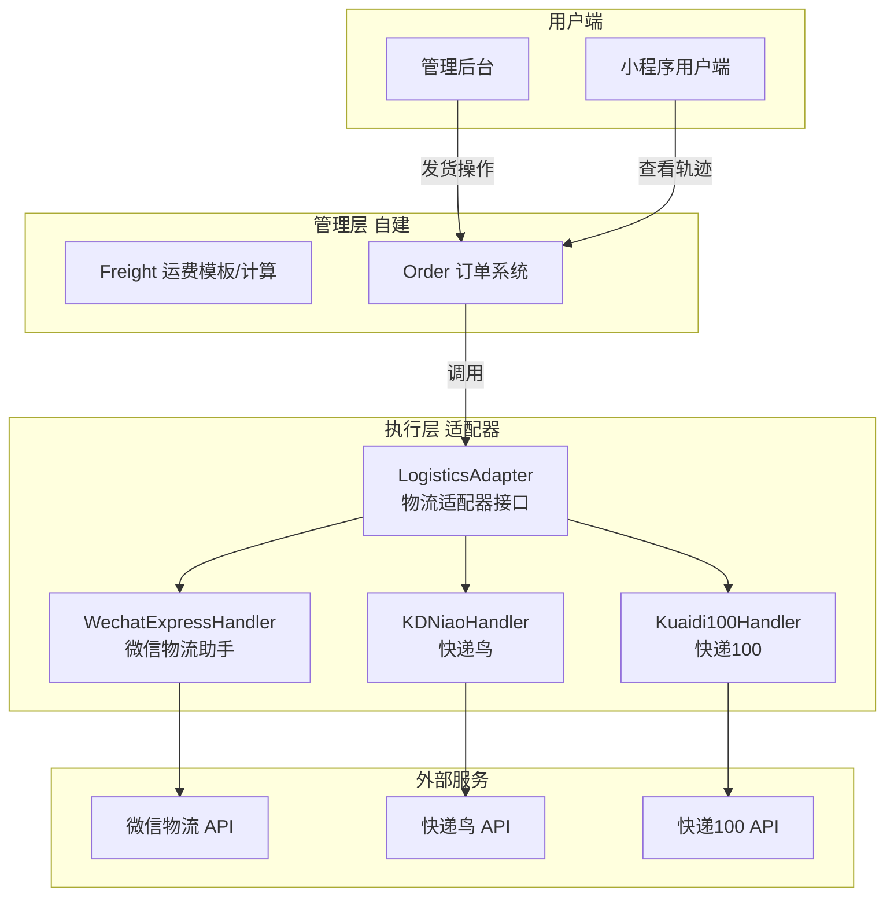
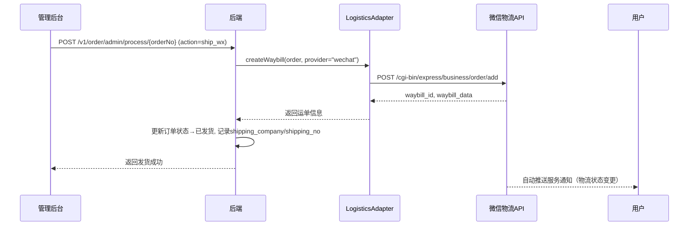

# 微信物流配送接入设计文档

## 1. 概述

本文档描述 mall 项目接入微信物流配送的方案。核心采用**共存架构**：自建 Freight 运费管理层 + 微信 ExpressService 执行层，并在外部执行层之上引入**多渠道适配器模式**，使系统可灵活切换/组合微信物流助手、快递鸟、快递100等多家物流服务商。

---

## 2. 架构总览

### 2.1 分层关系



### 2.2 核心时序（以管理员发货为例）



---

## 3. 多渠道适配器模式

### 3.1 设计意图

不同物流服务商各有优劣（详见第6章对比），项目可能面临以下需求：

- **小程序端优先**使用微信物流助手（免费 + 服务通知）
- **管理后台发货**对接快递鸟/快递100（覆盖更多快递公司、更灵活）
- **后期扩展**其他渠道（如顺丰官方API、菜鸟API）

适配器模式将各服务商的差异封装在 Handler 内部，对业务层暴露统一接口。

### 3.2 接口定义

```python
# mall/service/logistics_adapter.py

from abc import ABC, abstractmethod
from typing import Optional

class LogisticsHandler(ABC):
    """物流执行器抽象接口"""

    @abstractmethod
    def create_waybill(self, order: dict, config: dict) -> dict:
        """创建电子面单/发货"""
        ...

    @abstractmethod
    def cancel_waybill(self, waybill_no: str, config: dict) -> bool:
        """取消运单"""
        ...

    @abstractmethod
    def get_track(self, company: str, waybill_no: str) -> list[dict]:
        """查询物流轨迹"""
        ...

    @abstractmethod
    def get_provider_name(self) -> str:
        """返回当前处理器名称"""
        ...
```

### 3.3 适配器注册中心

```python
# mall/service/logistics_adapter.py (续)

class LogisticsAdapter:
    """物流适配器 - 根据配路由到对应 Handler"""

    _handlers: dict[str, type[LogisticsHandler]] = {}

    @classmethod
    def register(cls, name: str, handler_cls: type[LogisticsHandler]):
        cls._handlers[name] = handler_cls

    @classmethod
    def get_handler(cls, name: str = "wechat") -> LogisticsHandler:
        handler_cls = cls._handlers.get(name)
        if not handler_cls:
            raise ValueError(f"不支持的物流提供商: {name}")
        return handler_cls()

    @classmethod
    def get_available_providers(cls) -> list[str]:
        return list(cls._handlers.keys())
```

### 3.4 按场景智能路由（可选增强）

可在适配器中加入路由策略，自动选择最优 Handler：

```python
def auto_select_handler(self, order: dict, channel: str = "mini_program") -> LogisticsHandler:
    """根据订单来源和渠道自动选择物流商"""
    if channel == "mini_program":
        # 小程序端优先使用微信物流助手（服务通知能力）
        return self.get_handler("wechat")
    # 管理后台/其他端使用快递鸟（快递覆盖面广）
    return self.get_handler("kdniao")
```

### 3.5 使用示例

```python
# 发货时
handler = LogisticsAdapter.get_handler("wechat")  # 或 "kdniao" / "kuaidi100"
result = handler.create_waybill(order_data, config)

# 查询轨迹
handler = LogisticsAdapter.get_handler(order.logistics_provider)
track = handler.get_track(order.shipping_company, order.shipping_no)
```

---

## 4. Phase A：快递配送（微信物流助手 Handler）

### 4.1 WechatExpressClient

封装微信快递配送全部接口，位于 `mall/common/wechat_express_utils.py`。

#### 核心方法

| 方法 | 对应微信接口 | 用途 |
|:---|:---|:---|
| `bind_account(delivery_id, biz_id, password, ...)` | 绑定/更新物流账号 | 商家绑定快递公司账号 |
| `get_all_accounts()` | 获取所有绑定的物流账号 | 查看已绑账号列表 |
| `add_order(order_data)` | 生成运单 | 下单发货，返回电子面单 |
| `cancel_order(order_id, waybill_id, delivery_id)` | 取消运单 | 撤销已下单的运单 |
| `get_order(order_id)` | 获取运单信息 | 查看单笔运单详情 |
| `batch_get_order(order_list)` | 批量获取运单信息 | 批量查询 |
| `get_path(delivery_id, waybill_id)` | 查询运单轨迹 | 查看物流轨迹 |
| `get_quota(delivery_id, biz_id)` | 查询电子面单余额 | 查看面单剩余数量 |

#### 请求流程

所有接口需先获取 `access_token`（复用微信支付同套凭据体系），每次请求的 `body` 以 JSON 提交。

### 4.2 ExpressService（微信 Handler 实现）

位于 `mall/service/express_service.py`，注册为 `LogisticsAdapter` 的 `wechat` handler。

#### 核心方法

```python
class WechatExpressHandler(LogisticsHandler):

    def get_provider_name(self) -> str:
        return "wechat"

    def create_waybill(self, order: dict, config: dict) -> dict:
        """调用微信 add_order 创建运单，返回 waybill_id + waybill_data"""
        client = WechatExpressClient()
        order_data = {
            "add_source": 0,
            "wx_appid": applet_appid,
            "order_id": str(order["id"]),
            "sender": {
                "name": config["sender_name"],
                "tel": config["sender_tel"],
                "province": config["sender_province"],
                "city": config["sender_city"],
                "area": config["sender_area"],
                "address": config["sender_address"]
            },
            "receiver": {
                "name": order["consignee"],
                "tel": order["tel"],
                "province": order["province"],
                "city": order["city"],
                "area": order["area"],
                "address": order["address"]
            },
            "shop": {"wxa_path": f"/pages/order/detail?id={order['id']}"},
            "cargo": {
                "count": order["total_quantity"],
                "weight": order.get("weight", 500),
                "space_x": config.get("space_x", 30),
                "space_y": config.get("space_y", 30),
                "space_z": config.get("space_z", 30)
            },
            "insured": {"use_insured": 0},
            "service": {"service_type": 0},
            "delivery_id": config["delivery_id"],
            "biz_id": config["biz_id"],
            "custom_remark": order.get("remark", "")
        }
        return client.add_order(order_data)

    def get_track(self, company: str, waybill_no: str) -> list[dict]:
        client = WechatExpressClient()
        result = client.get_path(company, waybill_no)
        # 格式化轨迹列表
        return [
            {
                "time": item["action_time"],
                "status": item["action_msg"],
                "location": item.get("action_location", "")
            }
            for item in result.get("path_item_list", [])
        ]

    def cancel_waybill(self, waybill_no: str, config: dict) -> bool:
        client = WechatExpressClient()
        result = client.cancel_order(config["order_id"], waybill_no, config["delivery_id"])
        return result.get("result_code") == "0"
```

### 4.3 ExpressAccount 数据表

```sql
CREATE TABLE `t_mall_express_account` (
  `id` int NOT NULL AUTO_INCREMENT,
  `delivery_id` varchar(32) NOT NULL COMMENT '快递公司ID（如 YTO, STO）',
  `biz_id` varchar(32) NOT NULL COMMENT '快递公司客户编码',
  `account_name` varchar(64) DEFAULT NULL COMMENT '账号名称(别名)',
  `password` varchar(128) DEFAULT NULL COMMENT '密码(加密存储)',
  `status` tinyint DEFAULT '1' COMMENT '状态 1启用 0禁用',
  `create_time` datetime DEFAULT CURRENT_TIMESTAMP,
  `update_time` datetime DEFAULT CURRENT_TIMESTAMP ON UPDATE CURRENT_TIMESTAMP,
  PRIMARY KEY (`id`)
) ENGINE=InnoDB DEFAULT CHARSET=utf8mb4 COMMENT='快递公司账号绑定表';
```

### 4.4 管理后台接口

路由前缀 `/v1/express`

| 路径 | 方法 | 功能 | Resource |
|:---|:---|:---|:---|
| `/account/list` | GET | 获取已绑物流账号列表 | ExpressAccountList |
| `/account/sync` | POST | 从微信同步已绑账号 | ExpressAccountSync |
| `/account/bind` | POST | 绑定新物流账号 | ExpressAccountBind |
| `/ship` | POST | 发货（电子面单） | ExpressShip |
| `/track` | GET | 查询轨迹 | ExpressTrack |

### 4.5 已有文件修改

**1. `mall/__init__.py`**：注册蓝图 namespace

**2. `Order/sql.py`**：
- `admin_process` 增加 `action='ship_wx'` 分支 → 调用 `LogisticsAdapter.get_handler("wechat").create_waybill`
- `_format_order_list` 返回增加 `logisticsVO`（物流公司+运单号+状态）

### 4.6 前端改动

- `mall-admin/src/api/express.js`：封装快递账号/发货/轨迹API
- 管理后台：订单详情页增加「微信发货」按钮，弹窗选择快递公司+填写面单信息
- 小程序 `order-detail`：对接 `ExpressTrack` 接口显示真实轨迹

---

## 5. Phase B：同城配送

（概要流程）

- **门店创建**：微信物流助手门店管理接口创建门店
- **充值**：预充值
- **预查询运费**：`pre_add_order` 预估配送费
- **创建配送单**：`add_order` 下单配送
- **实时通知**：微信自动推送配送状态变更
- **回调验签**：MD5 + token 验签，更新订单配送状态

---

## 6. 物流服务商对比

| 维度 | 微信物流助手 | 快递鸟 | 快递100 |
|:---|:---|:---|:---|
| **接入前提** | 已认证微信小程序 | 无平台绑定 | 无平台绑定 |
| **快递公司数** | 12家 | 国内777+ / 国际1410+ | 国内998+ / 国际1219+ |
| **电子面单** | ✅ | ✅ | ✅（支持17个电商平台） |
| **服务通知** | ✅ 微信模板消息自动推送 | ❌ 需自行通知 | ❌ 需自行通知 |
| **同城配送** | ✅ 达达+顺丰同城 | ❌ | ❌ |
| **费用** | 免费 | 1500-2000元/年 | 几百元/年 |
| **数据开放性** | 仅小程序可用 | 全端通用 | 全端通用 |
| **文档规范度** | 中等 | 优秀 | 良好 |

### 选型建议

- **纯微信小程序商城** → 微信物流助手优先（免费+服务通知）
- **H5/App/PC 多渠道** → 快递鸟/快递100
- **需要最多快递公司** → 快递鸟（国际）+ 快递100（国内）
- **开发初期/小团队** → 先接微信物流助手，后续按适配器模式扩展快递鸟

---

## 7. 实施步骤

1. 新建 `ExpressAccount` 数据表，执行 DDL
2. 实现 `WechatExpressClient`（微信API封装）
3. 实现 `LogisticsAdapter` + `WechatExpressHandler`
4. 创建 `router_express.py` 注册管理后台接口
5. 修改 `mall/__init__.py` 注册蓝图
6. 修改 `Order/sql.py` 增加 `ship_wx` 发货逻辑
7. 实现管理后台快递账号管理+发货页面
8. 实现小程序物流轨迹对接
9. （可选）实现快递鸟/快递100 Handler 扩展
10. 测试：绑定账号 → 发货 → 轨迹查询 → 取消运单 全流程
