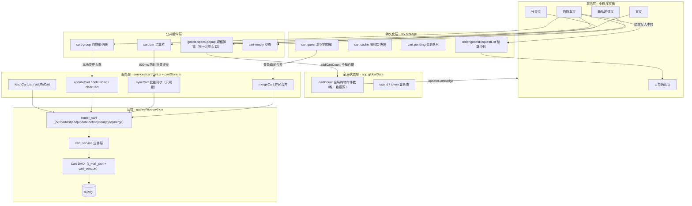
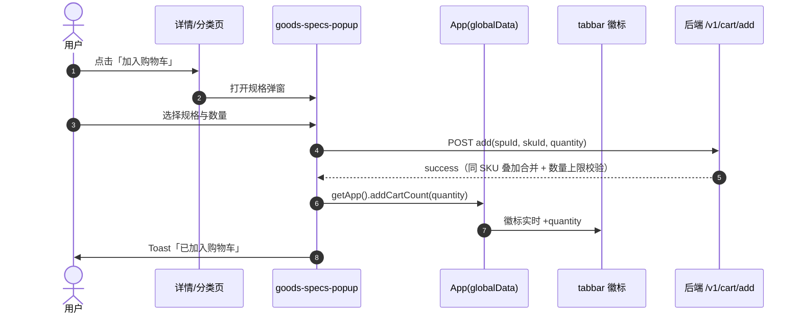
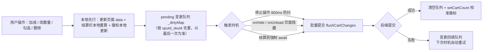
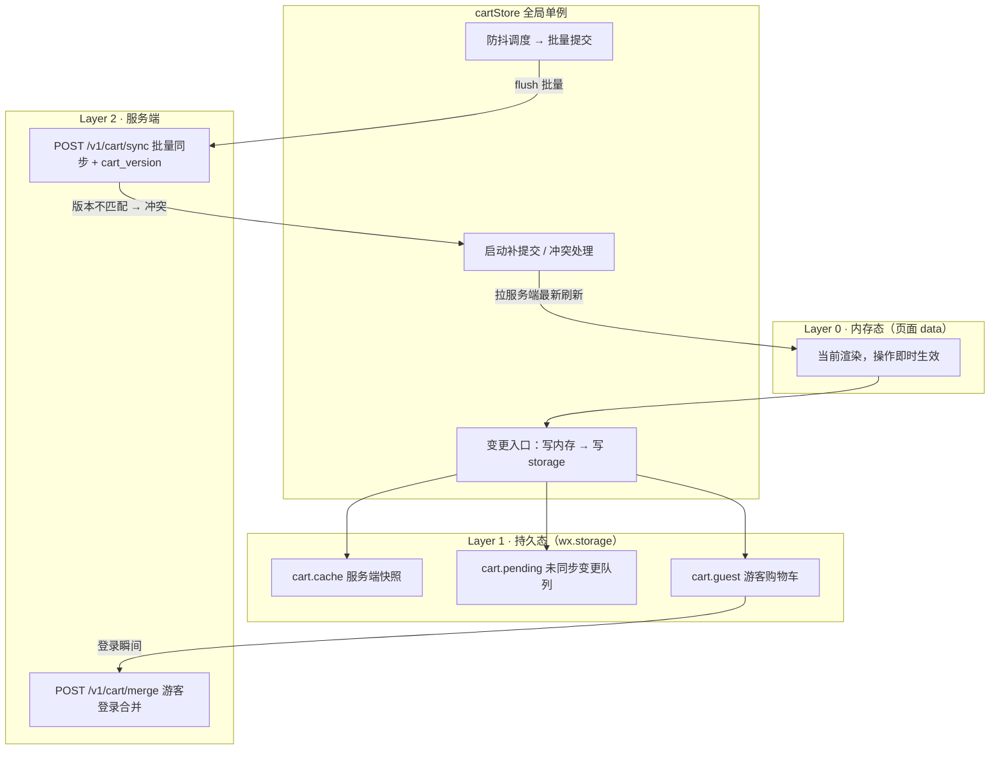

# 购物车后续优化设计文档

> 更新记录：
> - 2026-08-29（二）：全部规划项落地（cartStore 持久化缓存 + sync 批量接口 + 版本号乐观锁 + 游客模式合并 + 规格切换真实化 + 加购去向引导）；更新 2.4 目标架构为已实现状态与第 11 章状态总览（来源：CodeBuddy）
> - 2026-08-29：新增「购物车总体架构」章节（含 mermaid 架构图，流程标识）；修正原第 9 章标题编号错误（10.1/10.2 → 9.1/9.2）与重复代码块；更新角标状态表与实施优先级为最新落地状态（来源：CodeBuddy）

## 1. 概述

购物车基础功能（CRUD + 结算）已完成，本文档规划后续优化方向。

---

## 2. 购物车总体架构

### 2.1 分层架构图（现状）



### 2.2 加购链路（唯一入口）

#### 2.2.1 时序图



#### 2.2.2 链路要点

- **加购入口唯一**：`goods-specs-popup` 公共弹窗，详情页/分类页/首页共用；加购成功不依赖接口返回值，统一 `getApp().addCartCount(qty)` 全局自增，徽标实时变动。
- **加购实时写库**：加购必须等服务端确认拿到 `cartId` 才能入购物车队列，属低频操作，保持实时提交。
- **加购不碰库存**：加购全程不校验库存（仅在进销存有货时叠加），库存校验只在提交订单时执行（见第 9 章三重校验）。

### 2.3 购物车页操作与同步引擎（现状）



> 说明：当前 `_dirtyMap` 为**页面实例级内存队列**，页面被微信回收时变更会丢失；升级为 `cartStore` 单例 + storage 持久化（见 2.4）。

### 2.4 目标架构（已实现，2026-08-29）：前端缓存 + 批量同步 + 版本号



#### 2.4.1 三层缓存语义

| 层 | 载体 | 职责 | 落盘 |
|----|------|------|------|
| Layer 0 | 页面 data | 当前渲染，操作即时生效 | 否 |
| Layer 1 | wx.storage | 服务端快照 `cart.cache` + 未同步队列 `cart.pending` + 游客车 `cart.guest` | 是 |
| Layer 2 | MySQL | 权威数据源 | — |

#### 2.4.2 可靠性兜底

1. 变更**先写 storage 再调度同步**（不是同步成功才落盘）
2. `App.onLaunch` / 购物车页 `onShow` → 检查 `cart.pending` 非空 → 补提交（小程序进程被杀后重启自动补发）
3. 结算前强制 flush + `await` 完成（已实现，见 2.3）

#### 2.4.3 多端冲突处理（已实现）

- 后端 `t_mall_cart` 新增 `cart_version` 字段（用户级单调递增，所有写操作 `_bump_version` +1）
- `POST /v1/cart/sync` 入参带 `version`，后端**只有版本匹配才应用变更**，否则返回 `VERSION_CONFLICT` 冲突码
- 冲突策略（简洁版）：前端**丢弃本地变更、以后端为准**，提示"购物车已在其他设备修改，已为你刷新"，刷新列表后用户基于最新版本重新操作
  > 完整版（本地改过项覆盖服务端 diff 合并）留作多端高频场景下再实现，当前单店低频多端冲突足够

---

## 3. 购物车数量修改防抖

### 3.1 问题

用户在购物车页连续点击(+)/(-)时，每次触发 API 请求，高并发下可能导致请求乱序，数量不准确。

### 3.2 方案（已超额落地，2026-08-29）

> 原设计为"300ms 单条防抖"，现升级为**本地先行 + 变更队列去重 + 800ms 批量同步 + 结算强制 flush**，疯狂点 +1 只发 1 批请求。

```javascript
// pages/cart/index.js 或组件内
var quantityTimers = {};

function onQuantityChange(e) {
  var spuId = e.detail.goods.spuId;
  var skuId = e.detail.goods.skuId;
  var key = spuId + '_' + skuId;
  clearTimeout(quantityTimers[key]);
  quantityTimers[key] = setTimeout(function() {
    // 真正调 API
    updateCart({ spuId, skuId, quantity: e.detail.quantity }).then(refreshData);
  }, 300);
}
```

> 现状实现（`pages/cart/index.js`）：`applyLocalChange` 本地先行 → `enqueueChange` 入队（按 spuId_skuId 去重）→ `scheduleFlush` 800ms 防抖 → `flushCartChanges` 批量提交；`onHide/onUnload`、结算前 `await flushCartChanges()` 强制同步。详见 2.3 架构图。

---

## 4. 购物车 SKU 选中状态持久化

### 4.1 问题

目前选中状态存在后端 `t_mall_cart.is_selected` 字段，但选中状态应在关闭小程序后保持，选中在下次打开时仍处于选中状态。

### 4.2 现状

后端已存储 `is_selected` 字段，前端应该：

1. 进入购物车页 → `GET /v1/cart/list` → 读取每个 SKU 的 `isSelected`
2. 用户点击选中/取消 → `POST /v1/cart/update` → 改变 `is_selected`
3. 全选/取消全选 → 批量设置 `is_selected`

### 4.3 验证结果

✅ 已实现：后端 `t_mall_cart.is_selected` 存储 + list 返回 `isSelected`，前端 `refreshData` 正确恢复；全选/取消全选走本地先行 + 批量入队同步。

---

## 5. 购物车角标实时更新

### 5.1 问题

在非购物车页面加购后，购物车角标需即时更新。

### 5.2 方案（已全局统一，2026-08-29）

**统一为全局唯一数据源**：`app.globalData.cartCount` + `app.addCartCount(num)` 自增 + `app.updateCartBadge()` 刷新 tabbar；登录后 `syncCartCount()` 静默校准。

| 入口 | 文件 | 状态 |
|------|------|------|
| 分类页单规格加购 | `category/index.js` | ✅ 已统一（走 goods-specs-popup） |
| 分类页多规格弹窗加购 | `category/index.js` | ✅ 已统一 |
| 详情页底部 BuyBar | `details/index.js` | ✅ 已统一 |
| 详情页弹窗加购 | `details/components/goods-specs-popup` | ✅ 已统一（唯一入口） |

> 说明：详情页 BuyBar 与弹窗共用 `goods-specs-popup`，加购成功统一 `getApp().addCartCount(finalQuantity)`；购物车页 `updateBadge` 以列表真实件数为准走 `app.setCartCount` 校准。

---

## 6. 购物车空页面

### 6.1 问题

购物车无商品时显示空状态，引导用户去逛逛。

### 6.2 方案

`cart-empty` 组件已有，当 `cartGroupData.isNotEmpty === false` 时展示。

```html
<cart-empty wx:if="{{!cartGroupData.isNotEmpty}}" />
<cart-group wx:else ... />
```

---

## 7. 购物车商品失效管理

### 7.1 场景

| 场景 | 前端处理 | 后端处理 |
|------|---------|---------|
| SKU 售罄 | 失效区展示，不可选中，可删除 | `list` 接口返回 `invalidItems` |
| SPU 下架 | 失效区展示，显示"已下架" | `list` 接口校验 `is_put_on_sale` |
| 数量超库存 | 修正为最大库存，移入失效区 | `list` 接口修正 `quantity` |

### 7.2 前端交互

```
┌─ 正常商品 ─────────────────────┐
│ 商品A   ¥29.9   [+]2[-]  选中  │
│ 商品B   ¥19.9   [+]1[-]  选中  │
├─ 失效商品(2) ──────────────────┤
│ 商品C   已售罄       🗑 删除    │
│ 商品D   已下架       🔗 找相似  │
├─ 全选 / 合计 ──────────────────┤
│ 全选  ¥79.7   去结算(2)        │
└─────────────────────────────────┘
```

---

## 8. 重复商品合并提示

### 8.1 场景

用户已加购某 SKU，再次添加时提升数量，而非新增记录。

### 8.2 方案

后端 `add_to_cart` 有 `existing` 判断逻辑：

```python
existing = session.query(Cart).filter(
    Cart.user_id == user_id, Cart.sku_id == sku_id
).first()
if existing:
    new_qty = existing.quantity + quantity
    # 校验库存后更新
    existing.quantity = new_qty
```

该逻辑已实现，前端无需额外处理。

---

## 9. 购物车与库存实时同步

### 9.1 问题

用户在购物车页停留时间长时，库存可能变化。

### 9.2 方案

- 进入购物车页时 `GET /v1/cart/list` 自动校验库存
- 结算时 `POST /v1/order/preview` 再次校验库存
- 提交订单时 `POST /v1/order/create` 行级锁 `SELECT ... FOR UPDATE` 扣库存

三重校验保障。

---

## 10. 购物车数量上限

### 10.1 约束

| 限制 | 值 | 说明 |
|------|-----|------|
| 单次加购最大数量 | 99 | 单个 SKU 单次购买 |
| 购物车商品总件数 | 200 | 超过提示"购物车已满" |
| 购物车单个数量上限 | 999 | 单个 SKU 的最大数量 |

### 10.2 后端校验（已实现，2026-08-29）

`mallservice-python/mall/db/models/Cart/sql.py` 已补齐：

```python
MAX_PER_ADD = 99      # 单次加购最大数量
MAX_PER_SKU = 999     # 单个 SKU 在购物车中的最大数量
MAX_CART_ITEMS = 200  # 购物车商品总件数上限

if quantity <= 0 or quantity > MAX_PER_ADD:
    return {'success': False, 'message': '单次最多购买{}件'.format(MAX_PER_ADD)}

total_cart = session.query(func.sum(Cart.quantity)).filter(...).scalar() or 0
if total_cart + quantity > MAX_CART_ITEMS:
    return {'success': False, 'message': '购物车已满，最多{}件商品'.format(MAX_CART_ITEMS)}

# add_to_cart：单次上限、总量上限、单 SKU 上限（叠加后）
# update_cart：单 SKU 上限（qty > 999 拒绝）
```

---

## 11. 实施状态总览

| 优先级 | 功能 | 状态 | 说明 |
|--------|------|------|------|
| P0 | 选中状态持久化验证 | ✅ 已实现 | `is_selected` 后端持久化 + 前端恢复（第 4 章） |
| P0 | 加购入口补齐 | ✅ 已实现 | 唯一入口 `goods-specs-popup` 全局自增（第 5 章） |
| P0 | 数量修改防抖 | ✅ 已超额完成 | 本地先行 + 队列去重 + 800ms 批量同步 + 结算强制 flush（第 3 章） |
| P0 | 失效商品 UI 展示 | ✅ 已实现 | `invalidItems` 失效区（第 7 章） |
| P1 | 数量上限校验 | ✅ 已实现 | 后端 `MAX_PER_ADD/MAX_PER_SKU/MAX_CART_ITEMS`（第 10 章） |
| P1 | 前端持久化缓存 cartStore | ✅ 已实现 | `services/cart/cartStore.js` 单例：storage 三层缓存 + 补提交（2.4） |
| P1 | 批量同步接口 + 版本号 | ✅ 已实现 | 后端 `POST /v1/cart/sync` + `cart_version` 乐观锁 + `_bump_version`（2.4） |
| P1 | 游客模式 + 登录合并 | ✅ 已实现 | 后端 `POST /v1/cart/merge`；前端 `cart.guest` + 登录自动合并（2.4） |
| P0 | 购物车规格切换真实化 | ✅ 已实现 | 购物车点击规格 → 复用 `goods-specs-popup` 真实切换；后端 list 返回 `skuList`；`update_cart` 支持换 SKU（合并去重） |
| P0 | 加购去向引导 | ✅ 已实现 | 加购成功 `wx.showModal`「去购物车/继续逛」 |
| P2 | 多门店分组 | ⏸ 待产品方案 | 后端购物车加门店维度 + 结算拆单 |
